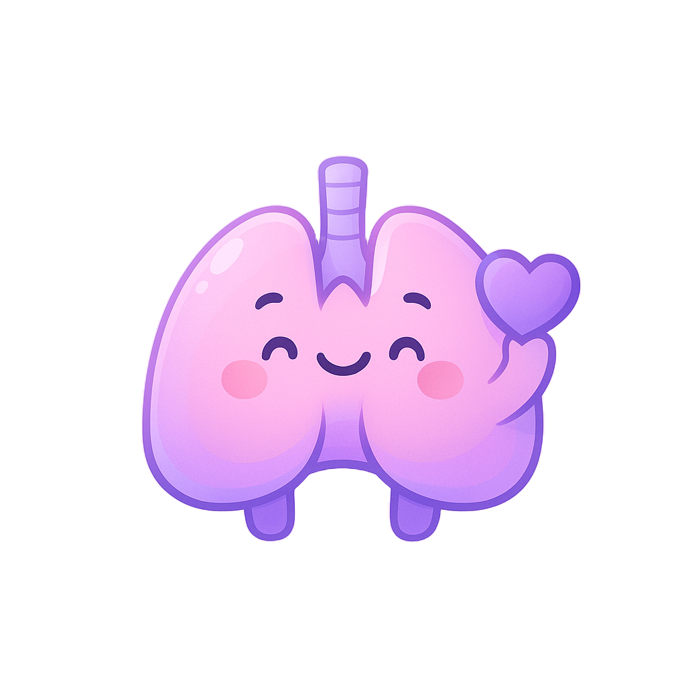

# 🫁 OxyHeal - Breathe Better, Live Healthier

<div align="center">



**Your Personal Lung Health Companion**

A comprehensive health tracking platform focused on respiratory wellness, lung cancer screening, and personalized health management.

[](https://reactjs.org/)
[](https://www.typescriptlang.org/)
[](https://fastapi.tiangolo.com/)
[](https://www.python.org/)
[](https://supabase.com/)

[Features](#-features) • [Tech Stack](#-tech-stack) • [Installation](#-installation) • [Usage](#-usage) • [API Documentation](#-api-documentation)

</div>

---

## 📋 Table of Contents

- [Overview](#-overview)
- [Features](#-features)
- [Tech Stack](#-tech-stack)
- [Project Structure](#-project-structure)
- [Installation](#-installation)
- [Configuration](#-configuration)
- [Usage](#-usage)
- [API Documentation](#-api-documentation)
- [Database Schema](#-database-schema)
- [Contributing](#-contributing)
- [License](#-license)

---

## 🌟 Overview

**OxyHeal** is a modern, full-stack health tracking application designed to help users monitor and improve their respiratory health. The platform combines advanced lung cancer risk assessment, guided breathing exercises, personalized nutrition plans, and comprehensive daily health logging.

### 🎯 Mission

To empower individuals with tools and insights for better lung health through early detection, preventive care, and lifestyle management.

---

## ✨ Features

### 🔬 Lung Cancer Screening
- **Comprehensive 5-Step Assessment**: Age, smoking history, symptoms, exposure risks, and family history
- **Risk Analysis**: Advanced algorithm based on clinical guidelines
- **Lung-RADS Scoring**: Professional-grade nodule classification (1-4C)
- **LDCT Report Management**: Upload and track Low-Dose CT scan results
- **Personalized Recommendations**: Tailored next steps based on assessment results

### 🌬️ Breathing Exercises
- **5 Guided Exercises**:
  - 4-7-8 Breathing (Relaxation)
  - Deep Breathing (Lung Capacity)
  - Box Breathing (Focus & Calm)
  - Alternate Nostril (Energy Balance)
  - Breath of Fire (Vitality)
- **Real-Time Animations**: Visual breathing guides with phase transitions
- **Session Tracking**: Monitor duration, completion, and progress
- **Statistics Dashboard**: Track total sessions, duration, and favorite exercises

### 🥗 Personalized Diet Plans
- **AI-Generated Meal Plans**: 7-day comprehensive nutrition guides
- **Condition-Based Recommendations**: 
  - Anti-inflammatory foods for inflammation
  - Detox plans for smokers
  - Antioxidant-rich meals for nodule management
  - Respiratory support nutrition
- **Detailed Meal Breakdown**: Breakfast, lunch, snacks, and dinner
- **Foods Database**: Recommended and foods to avoid lists
- **Health Tips**: Lifestyle and dietary guidance

### 📊 Daily Health Logs
- **8 Key Metrics Tracking**:
  - Breathing quality (1-10 scale)
  - Cough frequency (times per day)
  - Water intake (glasses)
  - Steps count
  - Energy level (1-10)
  - Sleep quality (1-10)
  - Mood (great/okay/not good)
  - Symptoms (8 common respiratory symptoms)
- **Statistics & Trends**: 
  - Current logging streak
  - Average metrics
  - Trend analysis (improving/stable/declining)
  - Weekly and monthly charts
- **Notes & Medications**: Track additional observations and treatments

### 👤 Profile Management
- **User Information**: Name, email, age, height
- **Profile Picture Upload**: Image upload with validation
- **Account Settings**: Email uniqueness validation
- **Member Analytics**: Join date and account history

### 📱 Responsive Design
- **Mobile-First**: Optimized for all screen sizes
- **Modern UI**: Clean, intuitive interface with Tailwind CSS
- **Dark Mode Ready**: Professional color scheme
- **Accessibility**: ARIA labels and keyboard navigation

---

## 🛠️ Tech Stack

### Frontend
```
React 18.3              - UI Framework
TypeScript 5.6          - Type Safety
Vite 6.0                - Build Tool & Dev Server
TailwindCSS 3.4         - Styling Framework
Shadcn/ui               - Component Library
Lucide React            - Icon System
React Router 7.1        - Routing
React Query 5.62        - State Management
Recharts 2.15           - Data Visualization
```

### Backend
```
FastAPI 0.115           - Web Framework
Python 3.12             - Programming Language
Supabase (PostgreSQL)   - Database
JWT (python-jose)       - Authentication
Pydantic 2.10           - Data Validation
Passlib                 - Password Hashing
Python Multipart        - File Upload
```

### Development Tools
```
ESLint                  - Code Linting
Prettier                - Code Formatting
Git                     - Version Control
npm/bun                 - Package Management
```

---

## 📁 Project Structure

```
oxyheal-dashboard/
├── src/                          # Frontend source code
│   ├── components/              # React components
│   │   ├── ui/                 # Shadcn UI components
│   │   ├── BreathingAnimation.tsx
│   │   ├── HealthCard.tsx
│   │   ├── Navigation.tsx
│   │   └── MobileNav.tsx
│   ├── pages/                   # Page components
│   │   ├── Dashboard.tsx       # Main dashboard
│   │   ├── LungCancerScreening.tsx
│   │   ├── LungCancerResults.tsx
│   │   ├── Breathing.tsx
│   │   ├── Diet.tsx
│   │   ├── DailyLogs.tsx
│   │   ├── Profile.tsx
│   │   ├── Login.tsx
│   │   └── Signup.tsx
│   ├── lib/                     # Utility libraries
│   │   ├── api.ts              # Main API client
│   │   ├── lungCancerApi.ts
│   │   ├── breathingApi.ts
│   │   ├── dietApi.ts
│   │   └── dailyLogsApi.ts
│   ├── types/                   # TypeScript definitions
│   └── hooks/                   # Custom React hooks
│
├── backend/                     # Backend source code
│   ├── app/
│   │   ├── main.py             # FastAPI application
│   │   ├── auth.py             # Authentication logic
│   │   ├── dependencies.py      # Shared dependencies
│   │   ├── supabase_client.py   # Database client
│   │   ├── lung_cancer.py       # Screening endpoints
│   │   ├── breathing.py         # Exercise endpoints
│   │   ├── diet.py              # Diet plan endpoints
│   │   └── daily_logs.py        # Health log endpoints
│   ├── *.sql                    # Database schemas
│   ├── requirements.txt         # Python dependencies
│   └── Dockerfile              # Container configuration
│
├── public/                      # Static assets
├── .env                         # Environment variables
├── package.json                 # Node dependencies
├── tsconfig.json                # TypeScript config
├── tailwind.config.ts           # Tailwind config
├── vite.config.ts               # Vite config
└── README.md                    # This file
```

---

## 🚀 Installation

### Prerequisites
- Node.js 18+ or Bun
- Python 3.12+
- PostgreSQL (via Supabase)
- Git

### 1. Clone the Repository
```bash
git clone https://github.com/Pratik00531/Oxyheal.git
cd Oxyheal
```

### 2. Frontend Setup

```bash
# Install dependencies
npm install
# or
bun install

# Create .env file
cp .env.example .env

# Edit .env and add your Supabase credentials
VITE_SUPABASE_URL=your_supabase_url
VITE_SUPABASE_ANON_KEY=your_supabase_anon_key
VITE_API_URL=http://localhost:8000
```

### 3. Backend Setup

```bash
cd backend

# Create virtual environment
python3.12 -m venv venv
source venv/bin/activate  # On Windows: venv\Scripts\activate

# Install dependencies
pip install -r requirements.txt

# Create .env file
cat > .env << EOF
SUPABASE_URL=your_supabase_url
SUPABASE_SERVICE_ROLE_KEY=your_service_role_key
JWT_SECRET=your_secret_key_here
ALGORITHM=HS256
ACCESS_TOKEN_EXPIRE_MINUTES=60
UPLOAD_DIR=./uploads
EOF
```

### 4. Database Setup

Run the following SQL files in your Supabase SQL Editor:

```bash
# 1. Main schema (users table)
backend/schema.sql

# 2. Lung cancer screening
backend/lung_cancer_schema.sql

# 3. Breathing exercises
backend/breathing_schema.sql

# 4. Diet plans
backend/diet_schema.sql

# 5. Daily logs
backend/daily_logs_schema.sql

# 6. User profile columns
backend/user_profile_columns.sql

# 7. Fix RLS policies (optional)
backend/fix_rls.sql
```

---

## ⚙️ Configuration

### Environment Variables

#### Frontend (`.env`)
```env
VITE_SUPABASE_URL=https://your-project.supabase.co
VITE_SUPABASE_ANON_KEY=your_anon_key
VITE_API_URL=http://localhost:8000
```

#### Backend (`backend/.env`)
```env
SUPABASE_URL=https://your-project.supabase.co
SUPABASE_SERVICE_ROLE_KEY=your_service_role_key
JWT_SECRET=your_very_long_secret_key_here
ALGORITHM=HS256
ACCESS_TOKEN_EXPIRE_MINUTES=60
UPLOAD_DIR=./uploads
```

### Supabase Setup

1. Create a new Supabase project
2. Copy the project URL and keys
3. Run all SQL schema files in order
4. Enable Row Level Security (RLS) on tables
5. Configure storage bucket for file uploads (optional)

---

## 💻 Usage

### Development Mode

#### Start Frontend (Terminal 1)
```bash
npm run dev
# or
bun dev

# App runs on http://localhost:8080
```

#### Start Backend (Terminal 2)
```bash
cd backend
source venv/bin/activate
uvicorn app.main:app --reload --host 0.0.0.0 --port 8000

# API runs on http://localhost:8000
```

### Production Build

#### Frontend
```bash
npm run build
npm run preview
```

#### Backend
```bash
cd backend
gunicorn app.main:app -w 4 -k uvicorn.workers.UvicornWorker
```

### Docker Deployment

```bash
# Build backend image
cd backend
docker build -t oxyheal-backend .

# Run container
docker run -p 8000:8000 --env-file .env oxyheal-backend
```

---

## 📚 API Documentation

### Authentication Endpoints

#### Sign Up
```http
POST /auth/signup
Content-Type: application/json

{
  "email": "user@example.com",
  "password": "secure_password",
  "name": "John Doe"
}
```

#### Login
```http
POST /auth/login
Content-Type: application/x-www-form-urlencoded

username=user@example.com&password=secure_password
```

#### Get Current User
```http
GET /users/me
Authorization: Bearer {token}
```

#### Update Profile
```http
PUT /users/me
Authorization: Bearer {token}
Content-Type: application/json

{
  "name": "John Updated",
  "age": 45,
  "height": 175
}
```

### Lung Cancer Screening

#### Create Assessment
```http
POST /lung-cancer/assessments
Authorization: Bearer {token}
Content-Type: application/json

{
  "age": 55,
  "smoking_status": "current",
  "pack_years": 30,
  "years_since_quit": 0,
  "symptoms": ["persistent_cough", "breathlessness"],
  "exposure": ["asbestos"],
  "family_history": true
}
```

#### Get Assessments
```http
GET /lung-cancer/assessments
Authorization: Bearer {token}
```

#### Upload LDCT Report
```http
POST /lung-cancer/reports
Authorization: Bearer {token}
Content-Type: application/json

{
  "assessment_id": 1,
  "scan_date": "2025-11-15",
  "nodules_found": true,
  "nodule_details": {...},
  "lung_rads_category": "3"
}
```

### Breathing Exercises

#### Get Exercises
```http
GET /breathing/exercises
Authorization: Bearer {token}
```

#### Save Session
```http
POST /breathing/sessions
Authorization: Bearer {token}
Content-Type: application/json

{
  "exercise_id": 1,
  "duration": 300,
  "completion_status": "completed"
}
```

#### Get Statistics
```http
GET /breathing/stats
Authorization: Bearer {token}
```

### Diet Plans

#### Check Eligibility
```http
GET /diet/check-eligibility
Authorization: Bearer {token}
```

#### Get Diet Plan
```http
GET /diet/plan
Authorization: Bearer {token}
```

### Daily Logs

#### Save Log
```http
POST /daily-logs/
Authorization: Bearer {token}
Content-Type: application/json

{
  "mood": "great",
  "breathing_quality": 8,
  "cough_frequency": 2,
  "water_intake": 8,
  "steps": 10000,
  "energy_level": 7,
  "sleep_quality": 8,
  "symptoms": ["fatigue"],
  "notes": "Feeling good today"
}
```

#### Get Statistics
```http
GET /daily-logs/stats
Authorization: Bearer {token}
```

Full API documentation available at: `http://localhost:8000/docs` (Swagger UI)

---

## 🗄️ Database Schema

### Key Tables

- **users** - User accounts and profiles
- **lung_cancer_assessments** - Screening questionnaire responses
- **ldct_reports** - CT scan results and Lung-RADS scores
- **breathing_exercises** - Available breathing techniques
- **breathing_sessions** - User exercise history
- **diet_plans** - Generated meal plans
- **daily_logs** - Health metrics tracking

See `backend/*.sql` files for complete schema definitions.

---

## 🎨 Screenshots

### Dashboard
Modern, data-driven dashboard showing real-time health metrics and progress.

### Lung Cancer Screening
Step-by-step assessment with professional risk analysis and recommendations.

### Breathing Exercises
Interactive breathing guides with animated visuals and real-time instructions.

### Diet Plans
Personalized 7-day meal plans with detailed nutritional guidance.

### Daily Logs
Comprehensive health tracking with statistics and trend visualization.

---

## 🤝 Contributing

Contributions are welcome! Please follow these steps:

1. Fork the repository
2. Create a feature branch (`git checkout -b feature/AmazingFeature`)
3. Commit your changes (`git commit -m 'Add some AmazingFeature'`)
4. Push to the branch (`git push origin feature/AmazingFeature`)
5. Open a Pull Request

### Development Guidelines

- Follow TypeScript best practices
- Use ESLint and Prettier for code formatting
- Write meaningful commit messages
- Add comments for complex logic
- Update documentation for API changes

---

## 📄 License

This project is licensed under the MIT License - see the [LICENSE](LICENSE) file for details.

---

## 👨‍💻 Author

**Pratik Patel**
- GitHub: [@Pratik00531](https://github.com/Pratik00531)
- Email: patelpratik8489@gmail.com

---

## 🙏 Acknowledgments

- [React](https://reactjs.org/) - UI Framework
- [FastAPI](https://fastapi.tiangolo.com/) - Backend Framework
- [Supabase](https://supabase.com/) - Database & Authentication
- [Shadcn/ui](https://ui.shadcn.com/) - Component Library
- [Lucide](https://lucide.dev/) - Icon System
- [TailwindCSS](https://tailwindcss.com/) - Styling Framework

---

## 📞 Support

For support, email patelpratik8489@gmail.com or open an issue in the GitHub repository.

---

## 🔮 Roadmap

- [ ] Mobile app (React Native)
- [ ] Multi-language support
- [ ] Telemedicine integration
- [ ] Wearable device sync
- [ ] AI-powered health insights
- [ ] Community features
- [ ] Export reports to PDF
- [ ] Integration with healthcare providers

---

<div align="center">

**Made with ❤️ for better respiratory health**

⭐ Star this repo if you find it helpful!

</div>